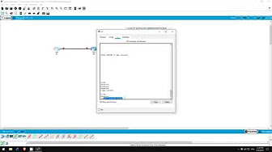

<header align="center">
  
</header>

<h2>
👨🏻‍💻 About
</h2>

<section>
  <details open>
    <summary>
      <h3>Currently Watching</h3>
    </summary>
<!--     <br/> -->
    <table>
      <tr>
        <td>
          <a href="https://www.youtube.com/playlist?list=PLxbwE86jKRgMpuZuLBivzlM8s2Dk5lXBQ">
               
            <p>
              Free CCNA 200-301 | Complete Course 2022
            </p>
          </a>
        </td>
        <td>
          <a href="https://www.youtube.com/playlist?list=PLxbwE86jKRgMQ4HTuaJ7yQgA2BoNwY9ct">
            
            <p>
              CCNA Routing & Switching Packet Tracer Labs
            </p>
          </a>
        </td>
      </tr>
    </table>
  </details>
  <br/>
  <details open>
    <summary>
      <h3>Currently Reading</h3>
    </summary>
<!--     <br/> -->
    <a href="https://www.amazon.com/Penetration-Testing-Hands-Introduction-Hacking/dp/1593275641">
        
        <p>Penetration Testing</p>
        <sub><p>Georgia Weidman</p></sub>
    </a>
  </details>
</section>
<br/>
<details>
  <summary>
    <h3>Some inconsequential code about myself ...</h3>
  </summary>

<!-- <br/> -->

```python
class schmwong(github.user):
  name = "Paul"
  country = "Singapore 🇸🇬"
  spoken_languages = {
      working: "English",
      second_working: "Mandarin Chinese",
      national: "Malay",
      colloquial: "Singlish"
  }
  personality = "INTP"
  interests = [
    "🔐 Cyber Security",
    "🤖 Process Automation in the Cloud",
    "💈 Data Pipelines"
  ]

  def __init__(self, birth_year=1582):
    super(schmwong, self).__init__(userinfo)
    self.age = datetime.now().year - int(birth_year)  # ♑
    account.type = "Personal"

  def thank_decorator(func):
    def wrapper():
      func()
      print("Thanks for dropping by")
    return wrapper

  @thank_decorator
  def hello():
    print(f"Hi, {name} here 👋")
    print(f"I'm from {country}")
```
<br/>
<header align="center">
  
</header>

<br/>

```java
類別 schmwong(github.使用者):
  名 = "Paul"
  國籍 = "新加坡 🇸🇬"
  語言能力 = {
    工作語言: "英式英語",
    第二工作語言: "華語",
    國語: "馬來語",
    口語: "星式英語"
  }
  人格 = "INTP"
  興趣 = [
    "🔐 網路安全",
    "🤖 雲端流程自動化",
    "💈 數據管道"
  ]
  
  定義 __初始__(俺, 出生年=1582):
    超級(schmwong, 俺).__初始__(使用者資訊)
    俺.年齡 = datetime.now().year - 整數(出生年) #♑
    帳號.類型 = "個人"
   
  定義 歡迎_裝飾器(函數):
    定義 包裝器():
      函數()
      印("歡迎參觀我的個人頁面")
    傳回 包裝器
  
  @歡迎_裝飾器
  定義 問候():
    印("你好, 我是, ", 名, " 👋")
    印("我來自 ", 國籍)
```

  <sub>
    <a href="https://github.com/gasolin/zhpy/blob/wiki/AboutZhpy.md">
      About Chinese Python
    </a>
  </sub>  
</details>

<details open>
  <summary>
    <h3>More inconsequential stuff (certs and such)</h3>
  </summary>
  <details>
    <summary>
<!--       <sub>
        <sup> -->
          Industry and Self-Paced
<!--         </sup>
      </sub> -->
    </summary>
<!--     <br/> -->
    <table>
      <tbody align="center">
        <tr>
          <td>
            <a href="https://www.credly.com/badges/f1676f95-19f1-4669-878d-ea39425872d0">
              
            </a>
          </td>
          <td>
            <a href="https://www.freecodecamp.org/certification/schmwong/scientific-computing-with-python-v7">
              
            </a>
          </td>
        </tr>
        <tr>
          <td>
            <a href="https://courses.edx.org/certificates/225c5c2e995f496189f35ebb93218fae">
              
            </a>
          </td>
          <td>
            <a href="https://courses.edx.org/certificates/7ab491e21e03400097e71cc497c76651">
              
            </a>
          </td>
        </tr>
        <tr>
          <td>
            <a href="https://courses.edx.org/certificates/1839600cfdc94671a5c81090d8590ca2">
              
            </a>
          </td>
          <td>
            <a href="https://courses.edx.org/certificates/afb3d6e39b934ac69514410ceb56df60">
              
            </a>
          </td>
        </tr>
      </tbody>
    </table>
  </details>
  <details>
    <summary>
<!--         <sup>
          <sub> -->
            Instructor-Paced
<!--           </sub>
      </sup> -->
    </summary>
<!--     <br/> -->
    <table>
      <tbody align="center">
        <tr>
          <td>
            <a href="https://credentials.nus.edu.sg/profile/wongshiming975517/transcript">
              
            </a>
          </td>
          <td>
            <a href="https://credentials.nus.edu.sg/profile/wongshiming975517/wallet">
              
            </a>
          </td>
        </tr>
      </tbody>
    </table>
    </br>
  </details>
</details>

<br/>
<section>
<!--  https://devicon.dev/  -->
  <h2>:bulb: Languages & Frameworks</h2>
  <a href="https://docs.python.org/3/">
    
  </a>
  <a href="https://developer.mozilla.org/en-US/docs/Glossary/HTML5">
    
  </a>
  <a href="https://www.w3.org/Style/CSS/">
    
  </a>
  <a href="https://developer.mozilla.org/en-US/docs/Web/JavaScript">
    
  </a>
  <a href="https://www.typescriptlang.org/docs/handbook/intro.html">
    
  </a>
  <a href="https://nodejs.org/en/docs/">
    
  </a> 
  <a href="https://www.gnu.org/software/bash/manual/bashref.html">
    
  </a>
  <a href="https://www.markdownguide.org/">
    
  </a>
  <a href="https://dev.mysql.com/doc/">
    
  </a>
  </br></br>
</section>
<section>
  <h2>:hammer_and_wrench: Tools I use</h2>
  <a href="https://docs.npmjs.com/">
    
  </a>
  <a href="https://git-scm.com/doc">
    
  </a>
  <a href="https://firefox-source-docs.mozilla.org/devtools-user/">
    
  </a>
  <a href="https://code.visualstudio.com/docs">
    
  </a>
  <a href="https://docs.github.com/en">
    
  </a>
  <a href="https://linux.die.net/">
    
  </a>
  <a href="https://quickstarts.postman.com/">
    
  </a>
  </br></br>
</section>
